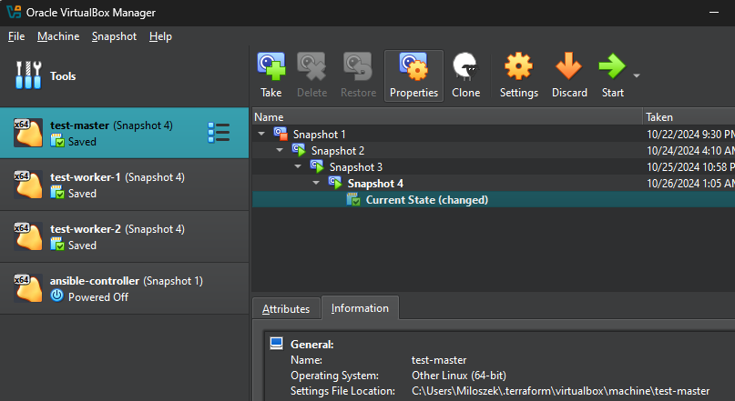

# Terraform-GCP-K8S Project Overview

## Introduction

This project demonstrates the implementation of Infrastructure as Code (IaC) to set up a secure and automated Kubernetes cluster using tools such as **Terraform**, **Ansible**, **Kubernetes**, and **Google Cloud Platform (GCP)**. The key objective is to showcase a streamlined deployment process emphasizing **automation**, **security**, and **scalability**. Below is a detailed explanation of the technologies used and the steps involved in the project.

---

## Visual Representation

A detailed diagram illustrating the workflow will be included here, showing the interaction between Terraform, Ansible, and Kubernetes components.

###
<div align="center">
  
</div>


---

## Technologies Used and Their Purpose

### 1. Google Cloud Platform (GCP)
**Purpose**: Provides the infrastructure for deploying virtual machines and associated networking.

- **Components used**:
  - Compute Engine (VM instances for Kubernetes nodes and Ansible controller)
  - VPC and Subnetwork (Networking for cluster communication)
  - Firewall Rules (Control access to cluster resources)
  - Identity-Aware Proxy (Secure SSH access without public IPs)
  - Cloud NAT (Internet access for private instances)
  - Cloud Key Management Service (Disk encryption)

**Why GCP?**
Its global presence, robust toolset, and integration with Terraform make it ideal for demonstrating cloud-based IaC principles.

---

### 2. Terraform
**Purpose**: Automates the provisioning of infrastructure in GCP.

- **Key Features**:
  - Declarative configuration using HCL (HashiCorp Configuration Language)
  - Multicloud support with extensive modules for GCP
  - Enables creation and management of resources such as VMs, networks, and firewalls.

**Why Terraform?**
It simplifies resource management and allows for version-controlled, repeatable deployments.

---

### 3. Ansible
**Purpose**: Configures and manages Kubernetes cluster components on deployed VMs.

- **Key Features**:
  - Agentless architecture using SSH for communication
  - YAML-based playbooks for defining tasks
  - Simplifies orchestration of complex configurations.

**Why Ansible?**
Its ease of use and modularity make it a perfect fit for automating configuration and Kubernetes setup.

---

### 4. Kubernetes
**Purpose**: Orchestrates containerized applications ensuring high availability and scalability.

- **Components**:
  - Control Plane: Manages worker nodes and the cluster.
  - Worker Nodes: Host containerized applications.
  - Add-ons: Includes Flannel for networking and MetalLB for load balancing.

**Why Kubernetes?**
It provides a resilient and scalable environment to manage containers, aligned with IaC principles.

---

## Deployment Workflow

The project follows a structured approach for setting up the Kubernetes environment:

1. **Provisioning Infrastructure with Terraform**:
   - Resources such as virtual machines, networks, and firewalls are created in GCP.
   - Outputs include private IPs and an inventory file (`hosts.ini`) for Ansible.

2. **Configuring Kubernetes Nodes with Ansible**:
   - The Ansible controller uses the inventory file to:
     - Install required dependencies (container runtime, Kubernetes tools).
     - Set up network configurations.
     - Initialize the Kubernetes cluster.

3. **Validating Configuration and Security**:
   - Tools such as Checkov, Trivy, and Kubeaudit validate the Terraform and Kubernetes configurations for security compliance.

4. **Deploying Applications**:
   - MetalLB is configured for load balancing.
   - NGINX is deployed to demonstrate application hosting within the cluster.

---

## Project File Descriptions

Below is a brief overview of the key files used in this project:

### Terraform Configuration Files (`*.tf`)
These files define the infrastructure setup and resources to be deployed on GCP:

- **`main.tf`**: The main Terraform configuration file that initializes the setup of resources and modules.
- **`network.tf`**: Configures the Virtual Private Cloud (VPC) and subnets for the project.
- **`instances.tf`**: Defines the virtual machine instances, including their specifications and metadata.
- **`security.tf`**: Configures the firewall rules and security policies for the infrastructure.
- **`ssh.tf`**: Sets up SSH keys and access for secure communication with the instances.
- **`iam.tf`**: Configures Identity and Access Management (IAM) roles and permissions.
- **`kms.tf`**: Manages Key Management Service (KMS) settings for disk encryption.
- **`outputs.tf`**: Outputs key information such as IP addresses and instance details for easy access.
- **`variables.tf`**: Declares variables used across the Terraform files for better modularity.

### Templates
These files are used as templates during the infrastructure provisioning process:

- **`startup-script-ansible.sh.tpl`**: A startup script for the Ansible controller VM to set up the necessary environment for configuration management.
- **`startup-script-master.sh.tpl`**: A startup script for the Kubernetes master node to initialize cluster setup.
- **`hosts.ini.tpl`**: A template for the Ansible inventory file to define hosts and their roles.

### Ansible Configuration Files
Files related to the configuration and automation of the Kubernetes cluster:

- **`ansible.cfg`**: Configures Ansible-specific settings, such as inventory file location and logging.
- **`hosts.ini.tpl`**: Defines the inventory for Ansible, specifying the master and worker nodes for the cluster.
- **`playbook.yml`**: Contains the Ansible playbook for setting up Kubernetes and deploying required configurations.

### Additional Files
- **`terraform.tfvars`** (not included in the repository): A user-specific file containing sensitive information such as project ID, region, and SSH user details. This file must be created manually as described in the setup section.


## 1. Setup

### Prerequisites

Before you begin, ensure you have the following tools installed on your system:

1. **Terraform**
   - Installation:
     ```bash
     # For Linux
     sudo apt-get update && sudo apt-get install -y terraform

     # For MacOS (using Homebrew)
     brew install terraform

     # For Windows
     # Download the executable from the official Terraform website and add it to your PATH.
     ```

2. **Google Cloud SDK (gcloud)**
   - Installation:
     ```bash
     # For Linux
     sudo apt-get install -y google-cloud-sdk

     # For MacOS (using Homebrew)
     brew install --cask google-cloud-sdk

     # For Windows
     # Download the installer from the official Google Cloud SDK website.
     ```
   - Authentication:
     ```bash
     gcloud auth login
     ```

3. **SSH Key**
   - Ensure you have an SSH key pair generated. If not, generate one using the following command:
     ```bash
     ssh-keygen -t rsa -b 4096 -C "your_email@example.com"
     ```
     
4. **Enable Required APIs**
   You need to enable the following APIs in your Google Cloud project:
   - Compute Engine API
   - IAM Service Account Credentials API
   - Cloud Resource Manager API

   To enable these APIs, run the following commands:
   ```bash
   gcloud services enable compute.googleapis.com
   gcloud services enable iamcredentials.googleapis.com
   gcloud services enable cloudresourcemanager.googleapis.com

### Terraform Configuration File

You need to create a `terraform.tfvars` file in the project directory. This file should include the following variables:

### Example `terraform.tfvars`

Here is an example of how the `terraform.tfvars` file might look:

```hcl
project_id = "YOUR_PROJECT_ID"
region     = "YOUR_PROJECT_REGION"
zone       = "YOUR_PROJECT_ZONE"
ssh_user   = "YOUR_PROJECT_SSH_USERNAME"

vm_names = [
  "test-master",
  "test-worker-1",
  "test-worker-2"
]

disk_encryption_key_raw = "YOUR_DISK_ENCRYPTION_KEY"
```

## 2. How to Run

### Step 1: Initialize Terraform
Before applying the configuration, initialize Terraform in the project directory:
```bash
terraform init
```

### Step 2: Plan the Deployment
To preview the changes and resources that will be created, run:
```bash
terraform plan
```

### Step 3: Apply the Configuration
To create the infrastructure defined in the Terraform files, execute:
```bash
terraform apply
```
You will be prompted to confirm the deployment. Type `yes`.

### Step 4: What Happens Next
After applying the configuration:
1. Terraform will provision the infrastructure in GCP:
   - One master node.
   - Two worker nodes.
   - Google Cloud Platform Overview
     ### Deployment Plan
      <div align="center">
        
      </div>

2. A Kubernetes cluster will be set up on the provisioned machines.
      <div align="center">
        
      </div>
4. You will have a ready-to-use Kubernetes environment with basic configurations.

## 3. Clean Up

To destroy all the resources created by Terraform, run:
```bash
terraform destroy
```
Confirm the action by typing `yes` when prompted.

---

## Additional Notes

- Ensure that your Google Cloud project has sufficient permissions for creating resources (e.g., VMs, networks).
- Adjust the `terraform.tfvars` file to suit your environment and requirements.
- Use a secure method to store and manage sensitive information like SSH keys and encryption keys.

## Initial Approach: Using VirtualBox Provider in Terraform

At the beginning of this project, an attempt was made to implement the infrastructure using local virtual machines with the VirtualBox provider in Terraform. However, this approach was abandoned because it placed a significant load on the laptop's resources and offered limited scalability and features compared to Google Cloud Platform (GCP).
      <div align="center">
        
      </div>

